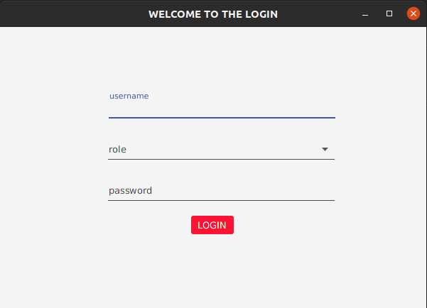
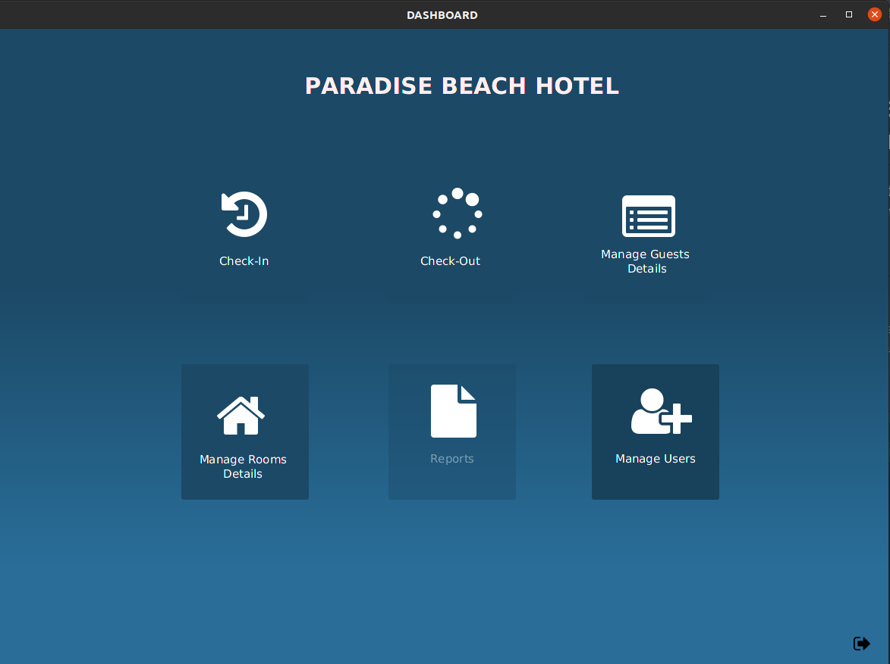
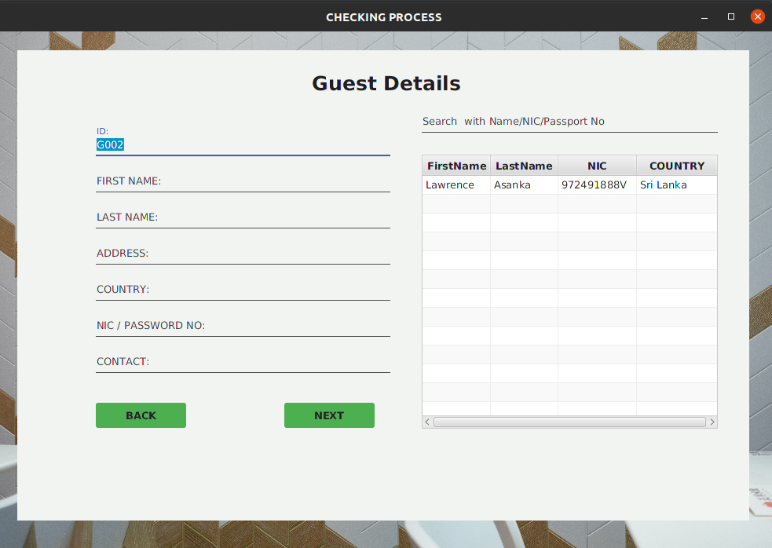
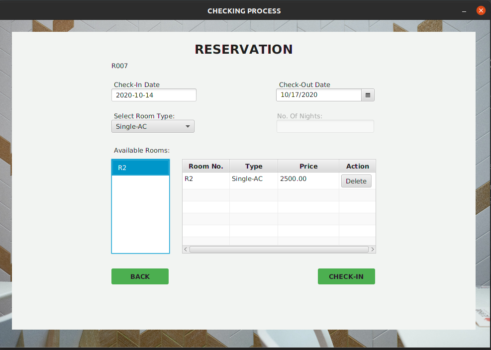
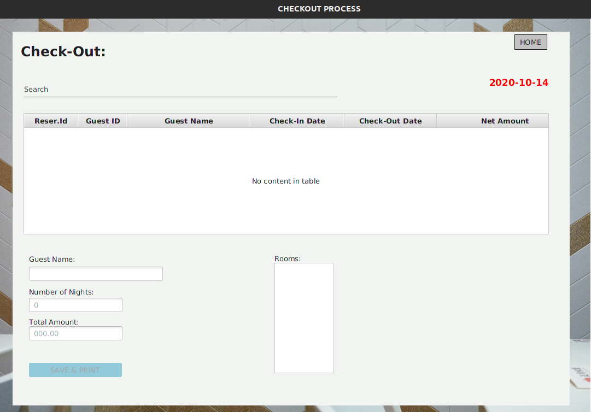
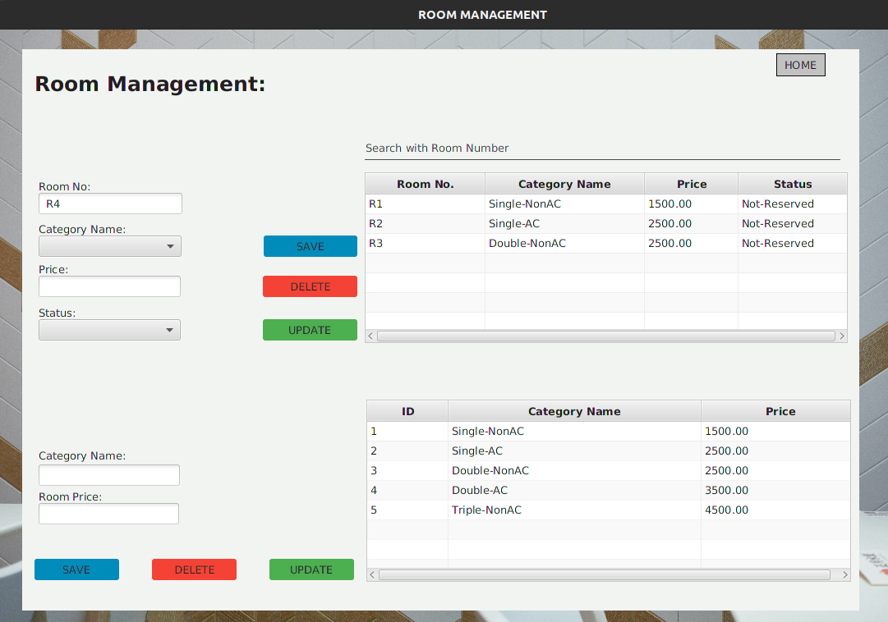

# Hotel Management System

## Introduction

Hotel Management System is a javaFX project for dealing with daily routing of Hotel.

## Snapshots
#### Login

#### Dashboard

#### Reservation Management

#### Checkout Process

#### Room Management

#### Guest Management

## Requirements

* Before use this application you must need to install [JAVA](https://www.oracle.com/java/technologies/javase/javase-jdk8-downloads.html) runtime environment and [MYSQL](https://www.mysql.com/) database management services.

#### Required JAR files
* [JFoenix](http://www.jfoenix.com/) - is an open source Java library, that implements Google Material Design using Java components
* [FontAwesomeFX-8.2](https://bitbucket.org/Jerady/fontawesomefx/downloads/) - FontAwesomeFX is an open source library adding Web Icons support to your JavaFX Apps! Including FontAwesome, WeatherIcons, Google Material Icons.
* [MySQL Connector](https://dev.mysql.com/downloads/connector/j/) - MySQL Connector/J is the official JDBC driver for MySQL.

## Installation

 1. Clone or Download the repository.
 2. Create a Database using [script.sql](script.sql) file.
 3. Download the required library files.
 4. Create a lib file inside the project directory and copy those jar files into that.
 5. Find Database Configuration From src/dbConnection, and set your Database name,user name and password.
 6. Test it!.
 
## Features

* Librarians can be given their authorized user name and password without which the system cannot be accessed.
* After logging in librarians can search for a specific book, book issue or member.
* Librarians need to make an entry for new books and new members.
* Librarian can issue available books.
 
## Contributing
Pull requests are welcome. For major changes, please open an issue first to discuss what you would like to change.
Please make sure to update tests as appropriate.

## License
Distributed under the MIT License. See [License](LICENSE) for more information.
